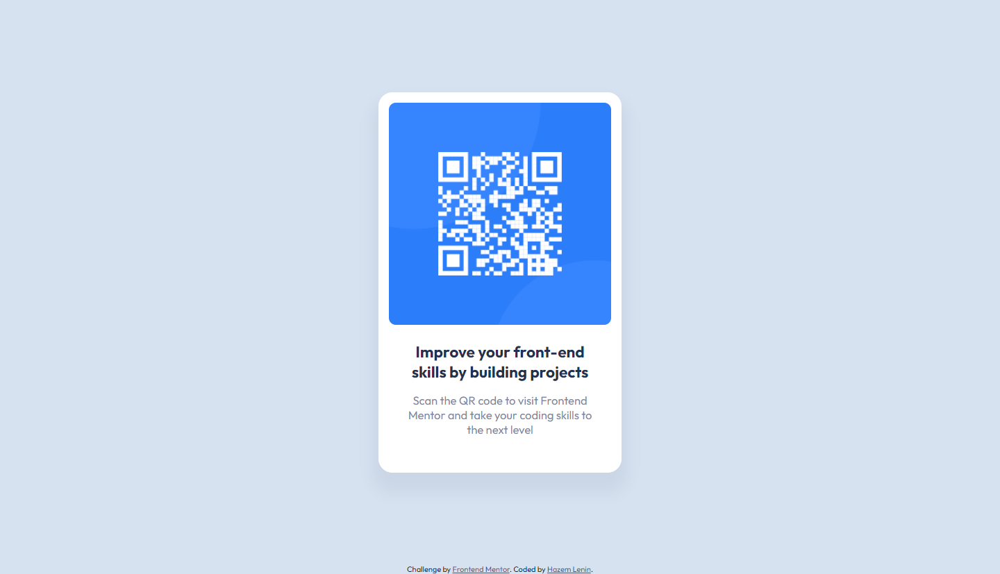

# Frontend Mentor - QR code component solution

This is a solution to the [QR code component challenge on Frontend Mentor](https://www.frontendmentor.io/challenges/qr-code-component-iux_sIO_H). Frontend Mentor challenges help you improve your coding skills by building realistic projects. 

## Table of contents

- [Overview](#overview)
  - [Screenshot](#screenshot)
  - [Links](#links)
- [My process](#my-process)
  - [Built with](#built-with)
- [Author](#author)

## Overview

### Screenshot

### Links

- Solution URL: [Github](https://github.com/HazemLenin/interactive-rating-component-challenge-on-frontend-mentor)
- Live Site URL: [Github Pages](https://hazemlenin.github.io/qr-code-component-challenge-on-frontend-mentor/)

## My process

### Built with

- Semantic HTML5 markup
- Flexbox
- SASS (CSS preprocessor)

## Author

- Website - [Hazem Lenin](https://HazemLenin.github.io)
- Frontend Mentor - [@HazemLenin](https://www.frontendmentor.io/profile/yourusername)
